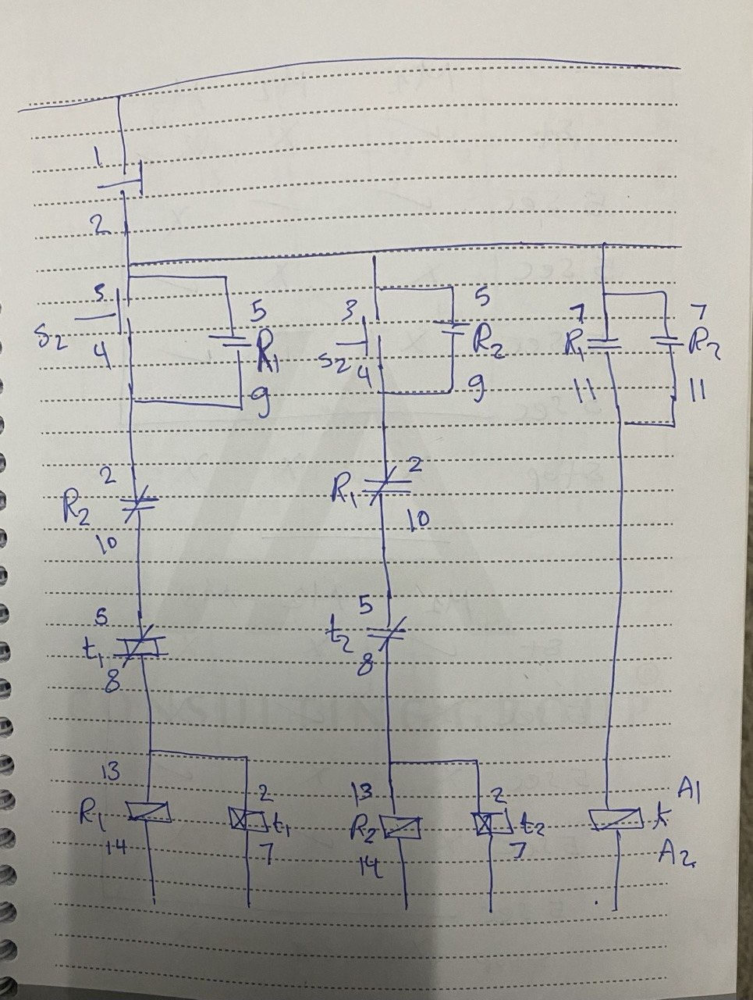

# Dual-Start-Motor-Control-with-Selectable-Time-Operation

## 📌 Project Overview

This project implements a **motor control system** with **two separate Start buttons**, where each button operates the motor for a different time duration.

* Start 1 → Motor runs for **10 seconds**
* Start 2 → Motor runs for **5 seconds**

The system uses **classic control (relay logic)** with timers and interlocking.

---

## ⚙️ Functional Requirements

* Press **Start 1**:

  * Motor runs for 10 seconds
  * Then automatically stops

* Press **Start 2**:

  * Motor runs for 5 seconds
  * Then automatically stops

* Press **Stop**:

  * Motor stops immediately (override)

---

## 🔧 Components Used

* Main Contactor (Motor)
* Timer Relay t1 (10 seconds - ON delay)
* Timer Relay t2 (5 seconds - ON delay)
* Start Button 1 (NO)
* Start Button 2 (NO)
* Stop Button (NC)

---

## ⚡ Control Logic Explanation

### 🔹 Start 1 Mode (10 seconds)

1. Press Start 1
2. Contactor is energized
3. Timer t1 starts counting
4. After 10 seconds → motor stops automatically

---

### 🔹 Start 2 Mode (5 seconds)

1. Press Start 2
2. Contactor is energized
3. Timer t2 starts counting
4. After 5 seconds → motor stops automatically

---

### 🔹 Stop Function

* Press Stop at any time → motor stops immediately
* Overrides both timers and any running mode

---

## 🔐 Interlocking Logic

* Start 1 and Start 2 cannot operate simultaneously
* Each start path disables the other to prevent conflict

---

## 🧠 Key Concepts

* Multi-start control
* Time-based operation
* Mode selection logic
* Interlocking
* Industrial control systems

---

## 📊 Operation Table

| Action  | Motor           |
| ------- | --------------- |
| Start 1 | ON (10s)        |
| Start 2 | ON (5s)         |
| Stop    | OFF immediately |

---

## 📷 Circuit Diagram

---

## 🎥 Demo Video

---

## 🚀 How to Operate

1. Power ON system
2. Choose:

   * Start 1 → 10 sec operation
   * Start 2 → 5 sec operation
3. Press Stop anytime to interrupt operation

---

## ⚠️ Notes

* Both timers are configured as ON delay
* Proper interlocking is required between Start 1 and Start 2
* Prevent simultaneous triggering of both modes
